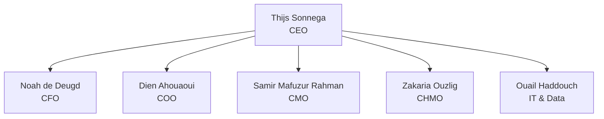
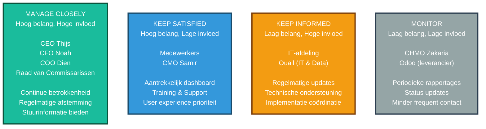
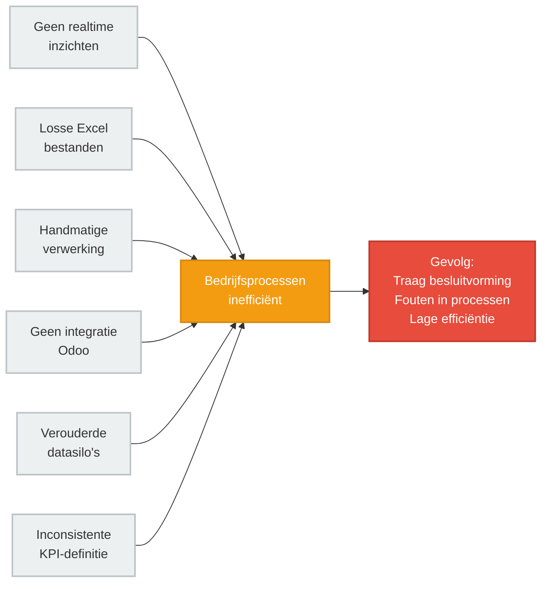
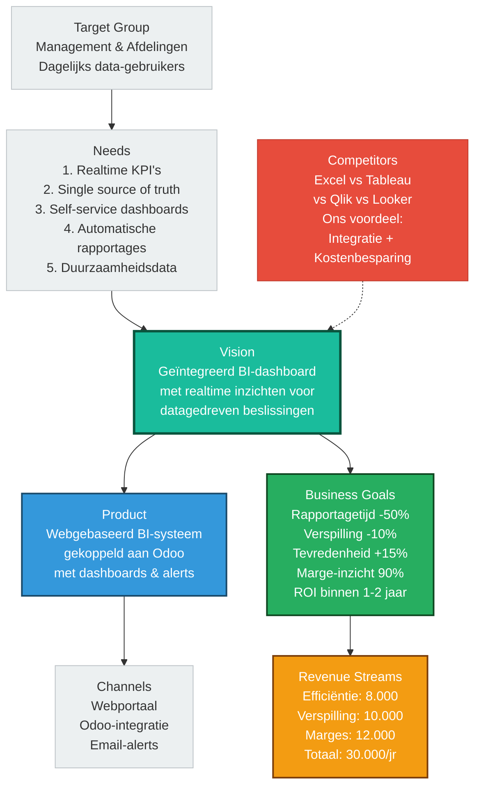
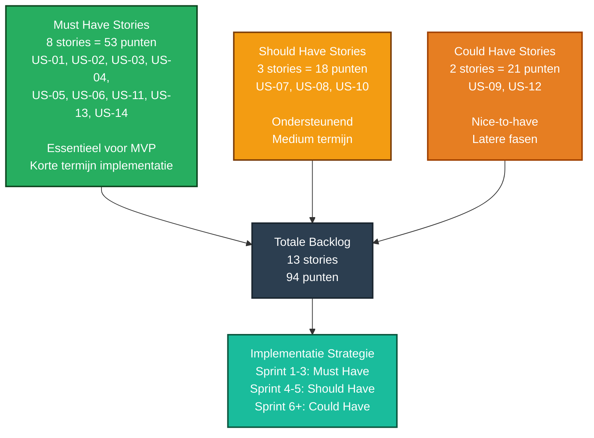
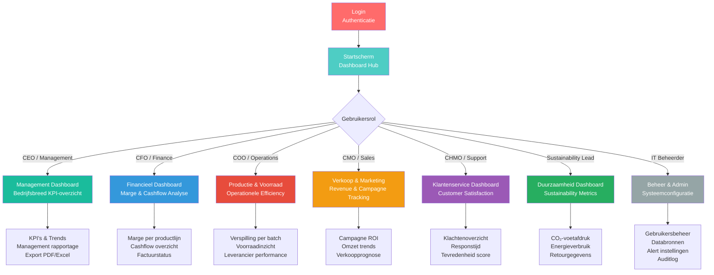

# Requirements Specificatie – BI-Dashboard Systeem
## De Cacaodroom

---

**Team:** De Cacaodroom  
**Teamleden:** Thijs Sonnega (CEO), Noah de Deugd (CFO), Dien Ahouaoui (COO), Samir Mafuzur Rahman (CMO), Zakaria Ouzlig (CHMO), Ouail Haddouch  
**Opleiding:** HBO-ICT – 1e jaar, 2e semester  
**Klas:** 2025_TICT-BV1SE2-23_3_V  
**Opleverdatum:** April 2026  
**Versie:** 1.0

---

## Inhoudsopgave

1. [Organisatorische Context](#1-organisatorische-context)
2. [Actoren van het systeem](#2-actoren-van-het-systeem)
3. [Bedrijfsprocesanalyse](#3-bedrijfsprocesanalyse)
4. [Productvisie – Product Vision Board](#4-productvisie--product-vision-board)
5. [User Stories](#5-user-stories)
6. [Definition of Ready & Definition of Done](#6-definition-of-ready--definition-of-done)
7. [Sitemap](#7-sitemap)
8. [Wireframes](#8-wireframes)

---

## 1. Organisatorische Context

### 1.1 Bedrijfsprofiel

**De Cacaodroom** is een snelgroeiend premium chocoladebedrijf dat actief is op de internationale markt voor chocolade. Het bedrijf verkoopt chocoladeproducten aan supermarkten, groothandels en speciaalzaken. De focus ligt op kwaliteit, bijzondere smaken en een luxe uitstraling.

Het bedrijf heeft recent een ERP- en CRM-systeem geïmplementeerd in **Odoo**, waardoor operationele processen zijn verbeterd. De volgende stap is het implementeren van een **Business Intelligence (BI)-dashboard** dat datagedreven besluitvorming mogelijk maakt voor het management en alle afdelingen binnen het bedrijf.

---

### 1.2 Missie

> "De Cacaodroom heeft als missie om mensen te laten genieten van onze chocoladebeleving. We creëren producten die niet alleen de smaakpapillen verwennen, maar ook het lichaam. Door ambachtelijke bereidingen en duurzame ingrediënten willen we onze klanten een ervaring bieden die hen terugbrengt naar de oorsprong van chocolade."

---

### 1.3 Visie

> "Onze visie is om de beste chocolade fabriek te zijn, waar smaak, kwaliteit en ethiek hand in hand gaan. We streven ernaar om chocolade te produceren die niet alleen uitzonderlijk lekker is, maar ook bijdraagt aan een duurzamere wereld."

---

### 1.4 Kernwaarden

| Kernwaarde | Omschrijving |
|---|---|
| **Ambachtelijkheid** | Respect voor traditie en lokale productie |
| **Duurzaamheid** | Samenwerking met eerlijke leveranciers, milieuvriendelijk proces |
| **Kwaliteit** | Allerbeste ingrediënten voor een onvergetelijke smaak |
| **Innovatie** | Constant op zoek naar nieuwe smaken en combinaties |
| **Passie** | Liefde voor chocolade in elke stap van het proces |

---

### 1.5 Strategische Doelstellingen

De volgende SMART-doelstellingen zijn opgesteld voor de BI-implementatie:

- **Binnen 6 maanden** heeft het management inzicht in marges per product en klantsegment, waarbij minimaal 90% van de producten wordt geanalyseerd op winstgevendheid.
- **Binnen 9 maanden** is de verspilling in de productie met minimaal 10% verminderd door gebruik van realtime BI-inzichten.
- **Binnen 6 maanden** is de klanttevredenheid met 15% verhoogd door beter inzicht in klachten, responstijden en leverbetrouwbaarheid.
- **Binnen 4 maanden** is de rapportagetijd met 50% verminderd door automatische BI-dashboards.
- **Binnen 5 maanden** is een centrale BI-omgeving ingericht waarin minimaal 80% van de KPI's gestandaardiseerd is als "single source of truth".

---

### 1.6 Organogram

Het onderstaande organogram toont de organisatiestructuur van De Cacaodroom:



**Rollen:**
- **CEO (Thijs Sonnega):** Eindverantwoordelijk voor strategie en bedrijfsvoering
- **CFO (Noah de Deugd):** Financiën, kosten, winstgevendheid, cashflow
- **COO (Dien Ahouaoui):** Operationele processen, productie, logistiek, inkoop
- **CMO (Samir Mafuzur Rahman):** Marketing, klantsegmentatie, campagnes
- **CHMO (Zakaria Ouzlig):** Human resources, medewerkersbeheer
- **Ouail Haddouch:** Ondersteunende rol / IT & data

---

### 1.7 Stakeholderanalyse

| Stakeholder | Rol | Belang | Invloed | Strategie |
|---|---|---|---|---|
| CEO (Thijs) | Eindgebruiker / beslisser | Strategisch overzicht, KPI's | Hoog | Actief betrekken, stuurinformatie bieden |
| CFO (Noah) | Primaire gebruiker | Financiële dashboards, marges | Hoog | Wekelijkse afstemming, financiële rapportages |
| COO (Dien) | Primaire gebruiker | Productie- en logistiek inzicht | Hoog | Realtime dashboards voor operationele sturing |
| CMO (Samir) | Primaire gebruiker | Campagne-effectiviteit, klantsegmenten | Middel | Marketingrapportages, klantdata |
| CHMO (Zakaria) | Secundaire gebruiker | Medewerkersinzichten | Laag | Periodieke rapportages |
| IT-afdeling | Beheerder | Technische implementatie en beheer | Middel | Technische ondersteuning en training |
| Medewerkers (alle afdelingen) | Eindgebruikers | Self-service dashboards per afdeling | Laag | Training en gebruiksgemak prioriteit |
| Raad van Commissarissen | Opdrachtgever | Strategisch overzicht bedrijfsprestaties | Hoog | Periodieke managementrapportages |
| Odoo (ERP/CRM leverancier) | Technische partner | Databron voor BI-integratie | Middel | API-koppeling documenteren |

### 1.7.1 Stakeholder Power/Interest Matrix



---

## 2. Actoren van het Systeem

Het BI-dashboardsysteem kent de volgende actoren (gebruikersrollen):

| Actor | Rol in het systeem | Rechten |
|---|---|---|
| **Management (CEO/CFO/COO)** | Strategische beslissers die bedrijfsbrede KPI's en dashboards raadplegen | Lezen van alle dashboards, exporteren van rapporten |
| **Financieel Manager (CFO)** | Analyseert marges, kosten, cashflow en winstgevendheid per productlijn | Toegang tot financiële dashboards en exportfuncties |
| **Operations Manager (COO)** | Monitort productieprocessen, voorraden, logistiek en leverbetrouwbaarheid | Toegang tot productie- en voorraadinzichten |
| **Marketing Manager (CMO)** | Evalueert campagnes, klantsegmenten en verkooptrends | Toegang tot verkoop- en marketingdashboards |
| **Afdelingsmedewerker** | Raadpleegt eigen afdelingsspecifieke dashboards via self-service | Leesrechten op afdelingsdashboard |
| **IT-beheerder** | Beheert het systeem, onderhoudt koppelingen en voert updates uit | Volledige beheertoegang, inclusief databronbeheer |
| **Odoo (extern systeem)** | Levert data via API-koppeling (ERP & CRM data) | Geen gebruikersrol, databron |

---

## 3. Bedrijfsprocesanalyse

### 3.1 Ist-Situatie (Huidige Situatie – As Is)

De huidige situatie van De Cacaodroom ergert zich nu door alle losse data en dat het niet efficiënt werkt:

#### Verkoop & Orderverwerking
Bestellingen komen binnen via mail, telefoon en vertegenwoordigers die orders noteren in eigen Excel-bestanden. Iedere medewerker heeft zijn eigen aanpak, waardoor versies door elkaar lopen en orders verloren gaan of dubbel worden verwerkt.

#### Productieplanning
De planner stelt handmatig een productieschema op zonder koppeling met actuele voorraadinformatie. Dit leidt tot stilstaande productielijnen of overproductie die onverkocht in het magazijn belandt.

#### Voorraadbeheer & Inkoop
De voorraad wordt bijgehouden in papieren logboeken. Bij drukte worden mutaties niet direct genoteerd. Inkoopbestellingen worden ad hoc geplaatst zonder vaste bestelpunten of minimumvoorraden.

#### Financiën
Rapportages worden wekelijks of maandelijks handmatig samengesteld in Excel. Er is geen dashboard voor cashflow, winstgevendheid of voorraadwaarde. Facturen worden handmatig opgesteld en openstaande betalingen blijven lang onopgemerkt.

#### Klantenservice
Er is geen centraal systeem met klantgegevens of klachthistorie. Medewerkers stellen telkens dezelfde vragen opnieuw en problemen worden incidenteel opgelost zonder structurele verbetering.

---

### 3.2 Knelpunten (Gap-analyse)

| Afdeling | Knelpunt | Gevolg |
|---|---|---|
| Alle afdelingen | Verspreide datasilo's (Odoo, Excel, papier, leveranciersportalen) | Geen centraal overzicht, trage besluitvorming |
| Management | Geen realtime inzichten | Beslissingen op basis van verouderde data |
| Verkoop | Losse Excel-bestanden per medewerker | Orders kwijt, dubbel verwerkt of te laat doorgegeven |
| Productieplanning | Planning zonder koppeling actuele voorraad | Stilstand productielijn of overproductie |
| Inkoop & Voorraad | Handmatige logboeken, geen real-time inzicht | Tekorten, overschotten, te late bestellingen |
| Productie | Kwaliteitscontrole wordt bij tijdsdruk overgeslagen | Fouten pas na verzending ontdekt |
| Logistiek | Handmatige labels, geen track & trace | Verkeerde leveringen, ontevreden klanten |
| Facturatie | Volledig handmatig, geen opvolging betalingen | Openstaande facturen, vertraagde inkomsten |
| Klantenservice | Geen klantdossier, geen klachtregistratie | Herhaling problemen, lage klanttevredenheid |
| Rapportage | Elke afdeling eigen templates en KPI-definities | Geen "single source of truth", inconsistente cijfers |

### 3.2.1 Oorzaken-Gevolgen Diagram



---

### 3.3 Soll-Situatie (Gewenste Situatie – To Be)

Na implementatie van het BI-dashboardsysteem:

- Alle data uit Odoo (ERP & CRM), Excel en externe bronnen wordt **automatisch geïntegreerd** in één centraal platform.
- Het management heeft **realtime toegang** tot bedrijfsbrede KPI's via een overzichtelijk dashboard.
- Elke afdeling heeft een **eigen afdelingsdashboard** met relevante KPI's en inzichten.
- KPI's zijn **gestandaardiseerd** en worden uniform berekend, zodat er één "single source of truth" is.
- Rapportages worden **automatisch gegenereerd**, waardoor handmatig werk sterk vermindert.
- Medewerkers kunnen via **self-service** zelf data opvragen en analyses uitvoeren zonder IT-tussenkomst.
- Trends, seizoenspieken en afwijkingen worden **proactief gesignaleerd** via alerts en notificaties.

---

### 3.4 SIPOC-Diagram

| Suppliers | Inputs | Process | Outputs | Customers |
|---|---|---|---|---|
| Odoo ERP | Verkooporders, facturen, voorraadinformatie | Data-integratie & ETL | Gestandaardiseerde datasets | Management |
| Odoo CRM | Klantdata, klachten, leads | Dashboard generatie | Realtime KPI-dashboards | Afdelingsmanagers |
| Productiesysteem | Batchdata, kwaliteitscontroles, verspilling | KPI-berekening | Automatische rapportages | Medewerkers |
| Externe bronnen | Leveranciersdata, energieverbruik | Alertgeneratie | Trends & voorspellingen | IT-beheerder |
| Excel-bestanden (tijdelijk) | Historische data | Self-service analyse | Exporteerbare rapporten | Raad van Commissarissen |

---

## 4. Productvisie – Product Vision Board

### 4.1 Vision

> **Het BI-dashboardsysteem van De Cacaodroom geeft het management en alle afdelingen realtime, datagedreven inzicht in bedrijfsprestaties — zodat beslissingen niet meer op gevoel worden genomen, maar op feiten. Het systeem transformeert verspreide datasilo's naar één centrale bron van waarheid, waarmee De Cacaodroom efficiënter, winstgevender en duurzamer kan groeien.**

---

### 4.2 Product Vision Board

| Sectie | Inhoud |
|---|---|
| **Vision** | Een geïntegreerd BI-dashboard dat alle afdelingen van De Cacaodroom voorziet van realtime inzichten, zodat datagedreven beslissingen de norm worden en de groei van het bedrijf structureel wordt ondersteund. |
| **Target Group** | Management (CEO, CFO, COO, CMO), afdelingsmanagers en medewerkers van De Cacaodroom die dagelijks werken met data over verkoop, productie, voorraad, financiën en klantenservice. |
| **Needs** | 1. Realtime inzicht in KPI's per afdeling (hoogste prioriteit) 2. Centrale "single source of truth" voor alle bedrijfsdata 3. Self-service dashboards zonder technische kennis 4. Automatische rapportages die handmatig werk vervangen 5. Inzicht in duurzaamheidsdata (CO₂, verspilling) |
| **Product** | Een webgebaseerd BI-dashboardsysteem gekoppeld aan Odoo, met afdelingsdashboards, realtime KPI-monitoring, self-service rapportages, trend- en voorspellingsanalyses, en alertfunctionaliteit bij afwijkingen. |
| **Business Goals** | 1. Rapportagetijd met 50% verminderen binnen 4 maanden 2. Productieverspilling met 10% verminderen binnen 9 maanden 3. Klanttevredenheid met 15% verhogen binnen 6 maanden 4. Inzicht in marges per product (90% dekking) binnen 6 maanden 5. ROI op BI-investering realiseren binnen 1-2 jaar |
| **Competitors** | Excel (huidige situatie – beperkt, foutgevoelig, niet realtime), Tableau (krachtig maar duur en complex), Qlik (goede integraties, hogere leercurve), Looker (Google-platform, minder geschikt voor MKB) |
| **Revenue Streams** | Kostenbesparing door efficiëntere rapportages (€8.000/jaar), minder verspilling in productie (€10.000/jaar), betere marges door datagestuurde sturing (€12.000/jaar) |
| **Cost Factors** | Implementatie & consultancy (€30.000 eenmalig), licenties (€1.800/jaar), beheer & doorontwikkeling (€8.000/jaar) |
| **Channels** | Intern webportaal toegankelijk via browser (desktop & tablet), integratie met bestaande Odoo-omgeving, e-mailnotificaties voor alerts en rapportages |

### 4.2.1 Product Vision Board Diagram



---

## 5. User Stories

### 5.1 Definitie van User Story Format

```
Als [rol]
Wil ik [actie/functionaliteit]
Zodat [doel/waarde]
```

**Schattingsschaal (Story Points – Fibonacci):** 1 | 2 | 3 | 5 | 8 | 13

---

### 5.2 Epic 1: Management Dashboard

---

**US-01 – Bedrijfsbreed KPI-overzicht**

> Als CEO wil ik een overzichtsdashboard zien met de belangrijkste KPI's van alle afdelingen, zodat ik in één oogopslag de prestaties van het bedrijf kan beoordelen.

**Acceptatiecriteria:**
- Het dashboard toont minimaal: omzet (dag/week/maand), productieverspilling (%), klanttevredenheid (score), voorraadstatus en openstaande facturen.
- Data wordt maximaal 15 minuten vertraagd weergegeven (near-realtime).
- KPI's zijn voorzien van een trendpijl (stijging/daling ten opzichte van vorige periode).
- Dashboard is bereikbaar via webbrowser zonder installatie.

**Story Points:** 8

---

**US-02 – Exporteren van managementrapportage**

> Als CEO wil ik een maandelijkse managementrapportage kunnen exporteren als PDF, zodat ik deze kan delen met de raad van commissarissen.

**Acceptatiecriteria:**
- Export is mogelijk als PDF en Excel.
- Rapportage bevat alle KPI's van de afgelopen maand met vergelijking vorige maand.
- Export is beschikbaar via een knop op het dashboard.
- Exporttijd is maximaal 30 seconden.

**Story Points:** 3

---

### 5.3 Epic 2: Financieel Dashboard

---

**US-03 – Marge per productlijn analyseren**

> Als CFO wil ik de winstmarge per productlijn en per klantsegment kunnen inzien, zodat ik kan sturen op winstgevende producten en klanten.

**Acceptatiecriteria:**
- Dashboard toont marge (%) per product en per klantsegment.
- Filtering mogelijk op periode (dag, week, maand, kwartaal, jaar).
- Minimaal 90% van actieve producten is opgenomen in de analyse.
- Data is rechtstreeks afkomstig uit Odoo (geen handmatige invoer).

**Story Points:** 8

---

**US-04 – Cashflow en openstaande facturen monitoren**

> Als CFO wil ik een realtime overzicht van cashflow en openstaande facturen, zodat ik liquiditeitsproblemen vroegtijdig kan signaleren.

**Acceptatiecriteria:**
- Dashboard toont totaal openstaande facturen, gemiddelde betalingstermijn en achterstallige betalingen.
- Alert wordt gegenereerd bij facturen die langer dan 30 dagen openstaan.
- Cashflowgrafiek toont historische trend van minimaal 12 maanden.

**Story Points:** 5

---

### 5.4 Epic 3: Productie & Voorraad Dashboard

---

**US-05 – Productieverspilling monitoren**

> Als COO wil ik realtime inzicht hebben in de verspilling per productiebatch, zodat ik maatregelen kan nemen om verspilling te verminderen.

**Acceptatiecriteria:**
- Dashboard toont verspillingspercentage per batch en per productielijn.
- Drempelwaarde instelbaar: alert bij verspilling boven ingesteld percentage.
- Historische vergelijking: huidige week vs. vorige week en vorige maand.
- Data is afkomstig uit het productiesysteem gekoppeld aan Odoo.

**Story Points:** 8

---

**US-06 – Voorraadinzicht en tekortmelding**

> Als COO wil ik realtime inzicht in voorraadniveaus met automatische melding bij dreigend tekort, zodat de productie nooit stil komt te staan door grondstoftekort.

**Acceptatiecriteria:**
- Dashboard toont actuele voorraad per product en grondstof.
- Automatische alert bij voorraad onder ingesteld minimumniveau.
- Overzicht van producten met voorraad = 0 en producten met negatieve voorraad.
- Leverbetrouwbaarheidsscore per leverancier zichtbaar.

**Story Points:** 5

---

**US-07 – Productieprestatie per uur inzien**

> Als COO wil ik de productie-output per uur en het aantal afgekeurde batches kunnen inzien, zodat ik de efficiëntie van de productielijn kan monitoren.

**Acceptatiecriteria:**
- KPI "productie per uur" zichtbaar per productielijn.
- KPI "afgekeurde batches" zichtbaar met trendlijn.
- KPI "doorlooptijd per order" zichtbaar.
- Data wordt per werkdag bijgewerkt.

**Story Points:** 5

---

### 5.5 Epic 4: Verkoop & Marketing Dashboard

---

**US-08 – Campagne-effectiviteit meten**

> Als CMO wil ik kunnen zien welke marketingcampagnes leiden tot de hoogste omzet per klantsegment, zodat ik marketingbudget effectiever kan inzetten.

**Acceptatiecriteria:**
- Koppeling tussen campagnedata (Odoo CRM) en verkoopresultaten.
- Omzet per campagne per klantsegment inzichtelijk.
- Vergelijking tussen campagnes mogelijk (periode, budget vs. omzet).
- Filtering op klantsegment (supermarkt, groothandel, speciaalzaak).

**Story Points:** 8

---

**US-09 – Seizoenspieken voorspellen**

> Als verkoopmanager wil ik voorspellingen kunnen zien op basis van historische verkoopdata, zodat ik de voorraad en productie tijdig kan aanpassen rondom seizoenspieken zoals Pasen en Kerst.

**Acceptatiecriteria:**
- Trendanalyse op basis van minimaal 2 jaar historische verkoopdata.
- Voorspelling zichtbaar voor komende 3 maanden.
- Grafische weergave van historische pieken per periode.
- Vergelijking met huidige verkoopprognose.

**Story Points:** 13

---

**US-10 – Klantenwinstgevendheid inzien**

> Als verkoopmanager wil ik kunnen zien welke klanten de hoogste marge opleveren, zodat ik prioriteit kan geven aan de meest winstgevende klantrelaties.

**Acceptatiecriteria:**
- Klantenoverzicht gesorteerd op winstmarge (hoog naar laag).
- Inzicht per klant: omzet, kosten, marge en orderfrequentie.
- Filtering op klantsegment en periode.
- Data afkomstig uit Odoo CRM & ERP.

**Story Points:** 5

---

### 5.6 Epic 5: Klantenservice Dashboard

---

**US-11 – Klachten en responstijden monitoren**

> Als klantenservicemanager wil ik een overzicht van klachten en responstijden, zodat ik de klanttevredenheid structureel kan verbeteren.

**Acceptatiecriteria:**
- Dashboard toont: aantal klachten per week, gemiddelde responstijd, type klachten (categorie), en klanttevredenheidsscore.
- Historische trend zichtbaar van minimaal 6 maanden.
- Alert bij responstijd langer dan ingestelde SLA-drempel.
- Data afkomstig uit Odoo Helpdesk.

**Story Points:** 5

---

### 5.7 Epic 6: Duurzaamheid Dashboard

---

**US-12 – Duurzaamheidsdata inzien**

> Als CEO wil ik dashboards zien met inzicht in CO₂-uitstoot, energieverbruik en retourpercentages, zodat ik kan rapporteren over duurzaamheidsdoelen en verbeteringen kan sturen.

**Acceptatiecriteria:**
- Dashboard toont: CO₂-uitstoot per batch, energieverbruik per maand, retourpercentage per productlijn.
- Vergelijking met doelstelling (target vs. actueel).
- Exporteerbaar als duurzaamheidsrapportage.
- Data kan handmatig worden aangevuld (externe bronnen) naast Odoo-data.

**Story Points:** 8

---

### 5.8 Epic 7: Systeem & Beheer

---

**US-13 – Gebruikers en rollen beheren**

> Als IT-beheerder wil ik gebruikers aanmaken, rollen toewijzen en toegangsrechten instellen, zodat elke medewerker alleen toegang heeft tot voor hem/haar relevante dashboards.

**Acceptatiecriteria:**
- Rollen aanmaken en wijzigen mogelijk via beheerscherm.
- Per rol instelbaar welke dashboards zichtbaar zijn.
- Gebruikers kunnen worden geblokkeerd of verwijderd.
- Auditlog bijgehouden van toegangswijzigingen.

**Story Points:** 5

---

**US-14 – Databronnen koppelen en beheren**

> Als IT-beheerder wil ik databronnen (Odoo, externe bestanden) kunnen koppelen en monitoren, zodat de data in dashboards altijd actueel en betrouwbaar is.

**Acceptatiecriteria:**
- Odoo ERP & CRM koppeling instelbaar via beheerscherm.
- Status van databronkoppeling zichtbaar (actief/fout/vertraagd).
- Handmatige import van Excel/CSV-bestanden mogelijk als fallback.
- Alert bij fout in databronkoppeling.

**Story Points:** 8

---

### 5.9 User Story Overzicht (Backlog)

| ID | Epic | Omschrijving | Story Points | Prioriteit |
|---|---|---|---|---|
| US-01 | Management | Bedrijfsbreed KPI-overzicht | 8 | Must Have |
| US-02 | Management | Exporteren managementrapportage | 3 | Must Have |
| US-03 | Financieel | Marge per productlijn analyseren | 8 | Must Have |
| US-04 | Financieel | Cashflow en openstaande facturen | 5 | Must Have |
| US-05 | Productie | Productieverspilling monitoren | 8 | Must Have |
| US-06 | Productie | Voorraadinzicht en tekortmelding | 5 | Must Have |
| US-07 | Productie | Productieprestatie per uur | 5 | Should Have |
| US-08 | Verkoop | Campagne-effectiviteit meten | 8 | Should Have |
| US-09 | Verkoop | Seizoenspieken voorspellen | 13 | Could Have |
| US-10 | Verkoop | Klantenwinstgevendheid inzien | 5 | Should Have |
| US-11 | Klantenservice | Klachten en responstijden | 5 | Must Have |
| US-12 | Duurzaamheid | Duurzaamheidsdata inzien | 8 | Could Have |
| US-13 | Beheer | Gebruikers en rollen beheren | 5 | Must Have |
| US-14 | Beheer | Databronnen koppelen en beheren | 8 | Must Have |
| **Totaal** | | | **94** | |

### 5.9.1 Backlog Prioriteits- & Complexiteitsoverzicht



---

## 6. Definition of Ready & Definition of Done

### 6.1 Definition of Ready (DoR)

Een user story is **klaar om opgepakt te worden** door het ontwikkelteam als aan de volgende criteria is voldaan:

- [ ] De user story is geschreven in het vastgestelde formaat (Als... wil ik... zodat...).
- [ ] Acceptatiecriteria zijn gedefinieerd en goedgekeurd door de product owner.
- [ ] De story points zijn geschat door het team.
- [ ] Eventuele afhankelijkheden van andere user stories zijn geïdentificeerd.
- [ ] De benodigde databronnen en API-koppelingen zijn bekend.
- [ ] De user story past in één sprint (max. 13 story points; anders splitsen).
- [ ] Er zijn geen openstaande vragen bij het team over de user story.

---

### 6.2 Definition of Done (DoD)

Een user story is **volledig afgerond** als aan de volgende criteria is voldaan:

- [ ] De functionaliteit is volledig ontwikkeld conform de acceptatiecriteria.
- [ ] De koppeling met Odoo (of andere databron) is getest en functioneert correct.
- [ ] Het dashboard of de functionaliteit is getest door minimaal één eindgebruiker (user acceptance test).
- [ ] Er zijn geen kritieke bugs aanwezig.
- [ ] De functionaliteit is gedocumenteerd (gebruikershandleiding of inline help).
- [ ] De code/configuratie is gecontroleerd door een tweede teamlid (peer review).
- [ ] De functionaliteit is beschikbaar in de productieomgeving.
- [ ] De product owner heeft de user story formeel geaccepteerd.

---

## 7. Sitemap

### 7.1 Dashboard-structuur en Navigatie

De onderstaande sitemap toont de architectuur van het BI-dashboardsysteem, met rollen-gebaseerde toegang en navigatiepad:



### 7.2 Pagina-details

| Dashboard | Doelgroep | Primaire KPI's | Visualisaties | Export |
|---|---|---|---|---|
| **Management** | CEO, Management | Omzet, winstmarge, CAC | Trends, heatmaps, gauges | PDF, Excel |
| **Financieel** | CFO, Finance team | Marge per product, cashflow | Waterfall, bar charts | Excel, CSV |
| **Productie & Voorraad** | COO, Production | Verspilling %, doorlooptijd | Line graphs, scatter plots | Report template |
| **Verkoop & Marketing** | CMO, Sales team | Omzet, conversierate, ROI | Pie charts, trend lines | Performance report |
| **Klantenservice** | CHMO, Support team | NPS, responstijd, klachten | Sentiment analysis, bar charts | Support report |
| **Duurzaamheid** | Sustainability Lead | CO₂, energieverbruik, retour % | Gauge charts, area charts | Sustainability report |
| **Beheer** | IT Administrator | System health, audit logs | Activity logs, user stats | Audit trail CSV |

---

## 8. Wireframes

> **Toelichting:** De wireframes zijn schematische schetsen van de belangrijkste schermen van het BI-dashboard. Ze tonen de structuur en lay-out zonder definitief ontwerp of kleuren. De wireframes zijn beschikbaar als interactieve HTML-bestanden.

---

### Wireframe 1 – Login scherm

[🔗 Open interactieve wireframe](wireframe-1-login.html)


---

### Wireframe 2 – Management Dashboard

[🔗 Open interactieve wireframe](wireframe-2-management.html)


---

### Wireframe 3 – Financieel Dashboard

[🔗 Open interactieve wireframe](wireframe-3-financieel.html)


---

### Wireframe 4 – Productie & Voorraad Dashboard

[🔗 Open interactieve wireframe](wireframe-4-productie.html)


---

### Wireframe 5 – Beheer scherm (IT-beheerder)

[🔗 Open interactieve wireframe](wireframe-5-beheer.html)


---

## Bijlagen

### Bijlage A – Functionele Requirements Samenvatting

| ID | Requirement | Prioriteit (MoSCoW) |
|---|---|---|
| FR-01 | Realtime KPI-dashboards per afdeling | Must Have |
| FR-02 | Koppeling met Odoo ERP & CRM via API | Must Have |
| FR-03 | Self-service rapportages en filtering | Must Have |
| FR-04 | Exportfunctie (PDF en Excel) | Must Have |
| FR-05 | Alertsysteem bij drempelwaardoverschrijding | Must Have |
| FR-06 | Gebruikers- en rolbeheer | Must Have |
| FR-07 | Campagne-effectiviteitsanalyse | Should Have |
| FR-08 | Verkoopprognose / seizoenspieken | Could Have |
| FR-09 | Duurzaamheidsdashboard (CO₂, energie) | Could Have |
| FR-10 | Handmatige Excel/CSV-import als fallback | Should Have |

### Bijlage B – Niet-Functionele Requirements

| ID | Requirement | Norm |
|---|---|---|
| NFR-01 | Beschikbaarheid | Minimaal 99% uptime tijdens kantooruren |
| NFR-02 | Prestatie | Dashboards laden binnen 5 seconden |
| NFR-03 | Data actualiteit | Data maximaal 15 minuten vertraagd (near-realtime) |
| NFR-04 | Gebruiksgemak | Bruikbaar door niet-technische gebruikers zonder training > 2 uur |
| NFR-05 | Beveiliging | Toegang via authenticatie, rollen en rechten per gebruiker |
| NFR-06 | Schaalbaarheid | Systeem schaalbaar bij groei naar internationale markten |
| NFR-07 | Browsercompatibiliteit | Werkt op Chrome, Edge en Safari (desktop & tablet) |
| NFR-08 | Taal | Nederlandstalige interface |

---

*Requirements Specificatie – De Cacaodroom BI-Dashboard Systeem | Versie 1.0 | April 2026*

---

## MMM-label


Deze Requirements Specificatie is opgesteld door ons team De Cacaodroom. De inhoud hebben wij zelf geschreven met lichte assistentie van AI.

Ter verbetering van de visuele presentatie en helderheid hebben wij een gedeelte AI toegepast:
- Mermaid-diagrammen voor complexe processen en relaties
- Verbeterde structurering en navigeerbaarheid
- Professionele visuele hiërarchie

**Betrokken partijen:** De Cacaodroom team (Thijs Sonnega, Noah de Deugd, Dien Ahouaoui, Samir Mafuzur Rahman, Zakaria Ouzlig, Ouail Haddouch)  
**Onderwijsinstelling:** HU University of Applied Sciences, HBO-ICT (1e jaar, 2e semester)  
**Datum:** April 2026
